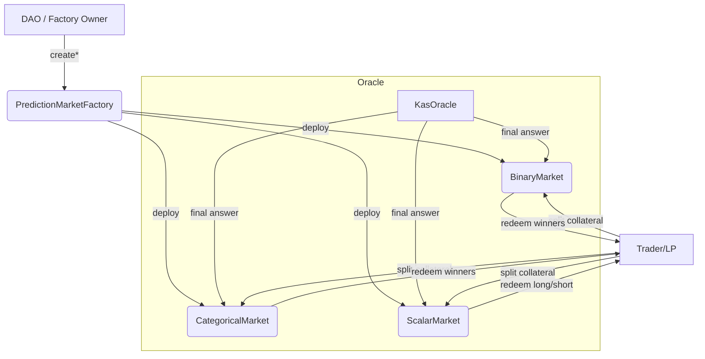
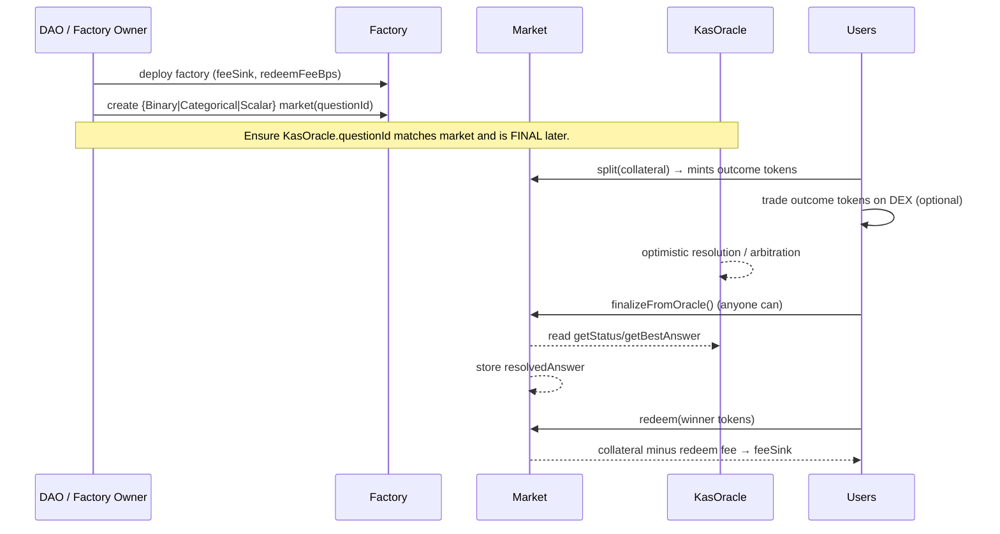

# Kaspa EVM Prediction Market — Backend Smart Contracts

> Uses **KasOracle** (your optimistic, bonded oracle) for resolution. This repo ships
> fully on-chain market contracts for **Binary**, **Categorical**, and **Scalar** markets
> with split/merge mechanics and post-resolution redemptions. Liquidity/trading can be done
> off-contract or on a DEX; these contracts handle minting, burning, settlement, and payouts.

## TL;DR Architecture



- Markets are **consumer-agnostic**: they don't require callbacks. Anyone can call
  `finalizeFromOracle()` once `KasOracle` is FINALIZED/ARBITRATED.
- Markets use the **complete set** pattern:
  - **Binary:** 1 collateral → 1 YES + 1 NO; winner redeems 1 token → 1 collateral (minus fee)
  - **Categorical (N):** 1 collateral → 1 token for each of N outcomes; winning token redeems 1
  - **Scalar:** 1 collateral → 1 LONG + 1 SHORT; LONG gets fraction *f*, SHORT gets *(1-f)*

> This isolates AMM/price discovery from settlement. List the outcome tokens on any Kasplex DEX.

## Contracts

- `PredictionMarketFactory.sol` — deploys markets; sets default redeem fee & fee sink.
- `market/MarketBase.sol` — shared logic: resolution pull from oracle, fee payout.
- `market/BinaryMarket.sol` — YES/NO split/merge + redeem.
- `market/CategoricalMarket.sol` — N-outcome split/merge + redeem winner.
- `market/ScalarMarket.sol` — LONG/SHORT split/merge + fraction payouts.
- `market/OutcomeToken.sol` — minimal ERC20 minted/burned by its market.
- `interfaces/IKasOracle.sol` — minimal interface to your oracle.

> These markets expect **KasOracle.encoded outcomes**:
> - Binary → `abi.encode(bool)`
> - Categorical → `abi.encode(uint256)` winning index
> - Scalar → `abi.encode(int256)` resolved value (within [min,max])

## Lifecycle



### Binary & Categorical Payout Invariants

- Pre-resolution: `merge()` allows burning **one of each outcome** to reclaim **1 collateral**.
- Post-resolution: **only** the winning token redeems collateral.
- Collateral conservation: total collateral locked equals **net split - pre-resolution merges - post-resolution redemptions**.

### Scalar Payout

Let range `[min,max]`, resolved `v`. We compute fraction:
```
f = (v - min) / (max - min)  (clamped to [0,1]), scaled by 1e18
```
- `redeemLong(amount)` → pays `amount * f`
- `redeemShort(amount)` → pays `amount * (1 - f)`

## Fee Model

- `redeemFeeBps` (default **1%**) is charged **only** on post-resolution payouts and sent to `feeSink` (DAO treasury).
- Factory owner (DAO/timelock) can adjust the **default** fee (capped at 10%) for new markets.

## Security Notes

- All markets use `SafeERC20` and `ReentrancyGuard`.
- Markets **do not custody** fees until resolution; collateral sits in the market contract.
- `finalizeFromOracle()` is permissionless → anyone can settle a market after oracle finality.
- This repo assumes your `KasOracle` is decentralized (DAO-controlled or immutable) and robust.

## Integration with KasOracle

Market contracts depend on two `IKasOracle` methods:
```solidity
function getStatus(bytes32 id) external view returns (Status);
function getBestAnswer(bytes32 id) external view returns (Answer memory);
```
- Call `finalizeFromOracle()` → reads final `encoded` and stores it.
- The Market does **not** assume oracle callbacks; if your oracle **does** call consumers, it's fine, but unnecessary.

## Deploy

```bash
npm i
export RPC_URL="https://rpc.kasplextest.xyz"
export PRIVATE_KEY="0xYOUR_KEY"
export OWNER="0xDAO_OR_MULTISIG"
export FEE_SINK="0xDAO_TREASURY"
export REDEEM_FEE_BPS="100"   # 1%
npm run deploy
```

Then, create markets (owner-only by default):
- `createBinary(collateral, oracle, questionId, marketName)`
- `createCategorical(collateral, oracle, questionId, marketName, outcomeCount, outcomeNames)`
- `createScalar(collateral, oracle, questionId, marketName, min, max, decimals)`

> **Important:** Make sure the `questionId` was created on your **KasOracle** with the intended template/rules.
> The market doesn’t create the question (to avoid coupling governance).

## Example Flows

### Binary
1. Alice `split(100)` → receives 100 YES + 100 NO
2. Bob buys 50 YES from Alice on a DEX (off-chain/DEX; not managed here)
3. Oracle finalizes outcome: **YES**
4. Anyone calls `finalizeFromOracle()`
5. Bob `redeem(50)` → receives 50 collateral minus fee; Alice can redeem remaining YES; NO is worthless

### Categorical (N outcomes)
- Same as binary except splitting mints **N tokens** and winner index is used on redemption.

### Scalar
- Alice `split(100)` → 100 LONG + 100 SHORT
- Oracle resolves `v` → `f` computed
- LONG redemptions pay `f * amount`; SHORT pays `(1-f) * amount`

## Gas & UX Tips

- Keep collateral to 18 decimals where possible for consistent math.
- For scalar markets, prefer integer ranges and publish your rounding rules in the oracle template.
- Surface `timeLeft` from the oracle in your frontend to show settlement readiness.

## Extending (Optional)

- Add **feesplitter** to distribute redeem fees between treasury and reporter incentives.
- Add per-market pause or cancel by DAO (e.g., if oracle question is malformed).
- Permissionless market creation via a registration fee + templates pre-approved by DAO.

## Audits & Tests

- This code follows standard practices but should be audited before large TVL.
- Suggested tests (Foundry/Hardhat):
  - Conservation of collateral across split/merge/redeem sequences
  - Oracle finality only unlocks redemption
  - Scalar rounding and clamping on extremes
  - Reentrancy guards on redemption
```


## User-created Listings & Fees

Users can now create markets directly from the factories by calling:
- `BinaryFactory.submitBinary(...)`
- `CategoricalFactory.submitCategorical(...)`
- `ScalarFactory.submitScalar(...)`

A flat creation fee of **100 BOND_TOKEN** is required for each user-submitted market. The fee is transferred to `FEE_SINK` and the market is registered on-chain.

**Env additions**
- `BOND_TOKEN` — ERC20 address used for the creation fee (bond token)
- `CREATION_FEE_UNITS` — (optional) raw units to override. If not provided, the deploy script computes `100 * 10**decimals(BOND_TOKEN)` automatically.
- `OWNER` — governing wallet (can remove/restore listings via `removeListing/restoreListing`)

### DAO/Governance moderation

The governing wallet (`OWNER`) can **soft-remove** malicious or explicit listings using `removeListing(market, reason)` and later `restoreListing(market)` if needed.
Frontends should read `isRemoved(market)` from the factory and hide removed markets.

### On-chain registry

Each factory records all created markets:
- `allMarkets(uint256)`
- `marketCount()`
- `isMarket(address)`
- `isRemoved(address)`

### User-created listing flow

```mermaid
flowchart TD
    A[User] -->|approves 100 BOND_TOKEN| B(BOND_TOKEN)
    A -->|calls submit* on factory| F(Factory)
    B -->|transferFrom(user → feeSink)| F
    F -->|deploys| M(New Market)
    F -->|register| R[Registry: allMarkets[]]
    F -->|emit *Created| L[Logs/Events]
    style A fill:#0fa,stroke:#0cf,stroke-width:2px,color:#000
    style F fill:#eef,stroke:#99f,stroke-width:2px
    style M fill:#efe,stroke:#9f9,stroke-width:2px
    style R fill:#ffe,stroke:#cc9,stroke-width:2px
```

<details>
<summary><strong>Text fallback</strong> (for viewers that don't render Mermaid)</summary>

User → (approve 100 BOND_TOKEN to Factory) → Factory
User → (submit*) → Factory
Factory → (transferFrom user→feeSink) → FeeSink
Factory → deploy → New Market
Factory → register → Registry (allMarkets[], isMarket, isRemoved)
DAO/Owner → removeListing/restoreListing → Registry flags
</details>
